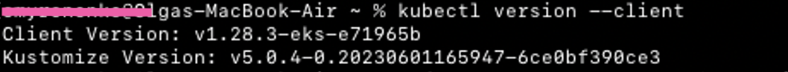
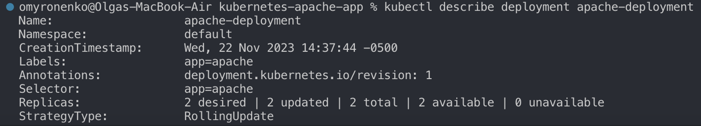

# Kubernetes Apache Project

## Initial Setup:

**Setting up kubectl on macOS**

I used the official [Kubernetes Documentation](https://kubernetes.io/docs/tasks/tools/install-kubectl-macos/#install-kubectl-on-macos) to install kubectl.

Next, I installed eksctl on macOS:
[eksctl](https://eksctl.io/installation/)

Check that both have been successfully installed by running the commands `kubectl version --client` and `eksctl version`.




Next, create a basic cluster using eksctl. Paste the following into the terminal:

```bash
eksctl create cluster \
> --node-type=t3.micro \
> --region=us-west-2 \
> --name=playground \
> --nodes=3 \
> --nodes-min=2 \
> --nodes-max=3
```


This will create a cluster with default settings (it will create the cluster in your default region in a default VPC, with one managed nodegroup with 2 m5.large nodes). If you'd like to include additional configurations, please visit the [eksctl official documentation website](https://eksctl.io/usage/creating-and-managing-clusters/).


 


It then creates a node group:


 


`kubectl get nodes`
You don’t see the control plane, you only manage the nodes with AWS EKS


Deployment of the apache application with 2 replicas


 





Creating LoadBalancer service, exposing application on port 80

 


Scaling the deployment:

 
